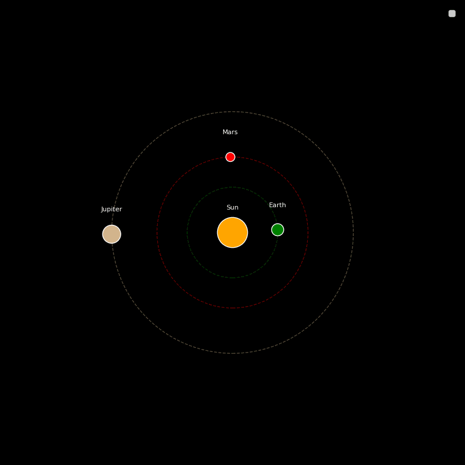
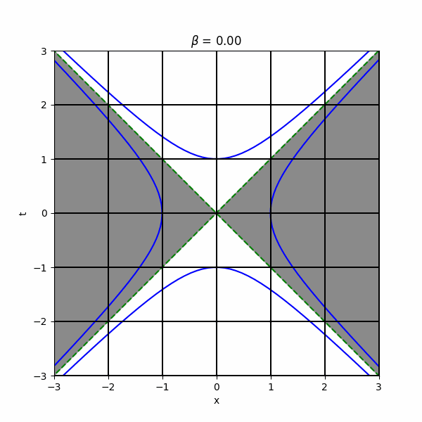

# Physics Simulations

A collection of computational physics projects combining Python programming with fundamental physics concepts. These simulations serve as both learning tools and visual demonstrations of physical principles.

## 1. Solar System Simulation
A numerical N-body simulation modeling planetary dynamics under Newtonian gravitation. Most constants were set to 1 for simplicity, such as mass or the gravitational constant. Therefore, this visualization should not be taken as a 1-to-1 comparison to actual stars. It is simply a visualization for orbital dynamics.

## 2. Lorentz Transformation Simulation
A visualization of special relativistic effects that occur at relativistic velocities. The β parameter quantifies the object's speed as a fraction of light speed, with space-time distortion becoming significant as β → 1. Note that the object isn't shown below, only the space that becomes distorted. 

## 3. Young's Double-Slit Experiment Simulation

